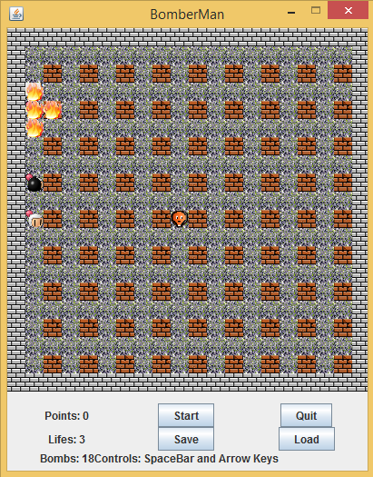

# Bomber Man

Map & Others
* [x] Size of the screen 20 x 20
* [x] Possibility to save the state of the game

Player
* [x] The player has 3 lifes
* [x] If the player has been caught by an explosion the game ends
* [x] Each life lost subtracts 5 points

Bombs
* [x] The number of bombs is limited to 20
* [x] The bomb when explods it can destroy two adjacent North, South, East and West directions

Walls
* [x] There's brick walls (grey blocks) that are destroyed by the explosions
* [x] There's rock walls (black blocks) that are not destroyable by the explosions
* [x] When the brick walls are all destroyed the game ends
* [x] When the brick wall blows up there's a chance of 50% that a bonus spaws. When the bonus is picked up by the player it increments the bombs by 2
* [x] Each brick wall destroyed grants the player 5 points

Enemies
* [x] There's enemies that wander around the free space
* [x] The enimies are destroyed by explosions
* [x] When a enemie is destroyed, another spawns
* [x] When they touch a player, the player loses a life
* [x] The game starts with an enemie in a random position
* [x] For each enemie destroyed the player gains one bomb

# Application Architecture
Drawable
  * Block
    * Wall
    * Floor
    * Brick
  * Temporary (Runnable)
    * Bomb
    * Explosion
    * Power Up
  * Entity
    * Player
    * Enemy (Runnable)

Game
  * JPanel
    * Board
    * Menu
  * Game Utilies
  * JFrame
    * Game
